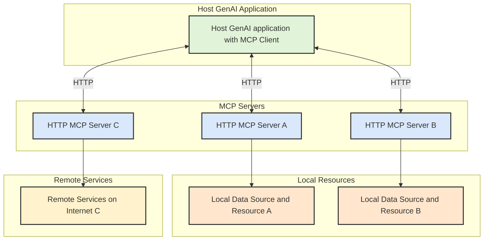
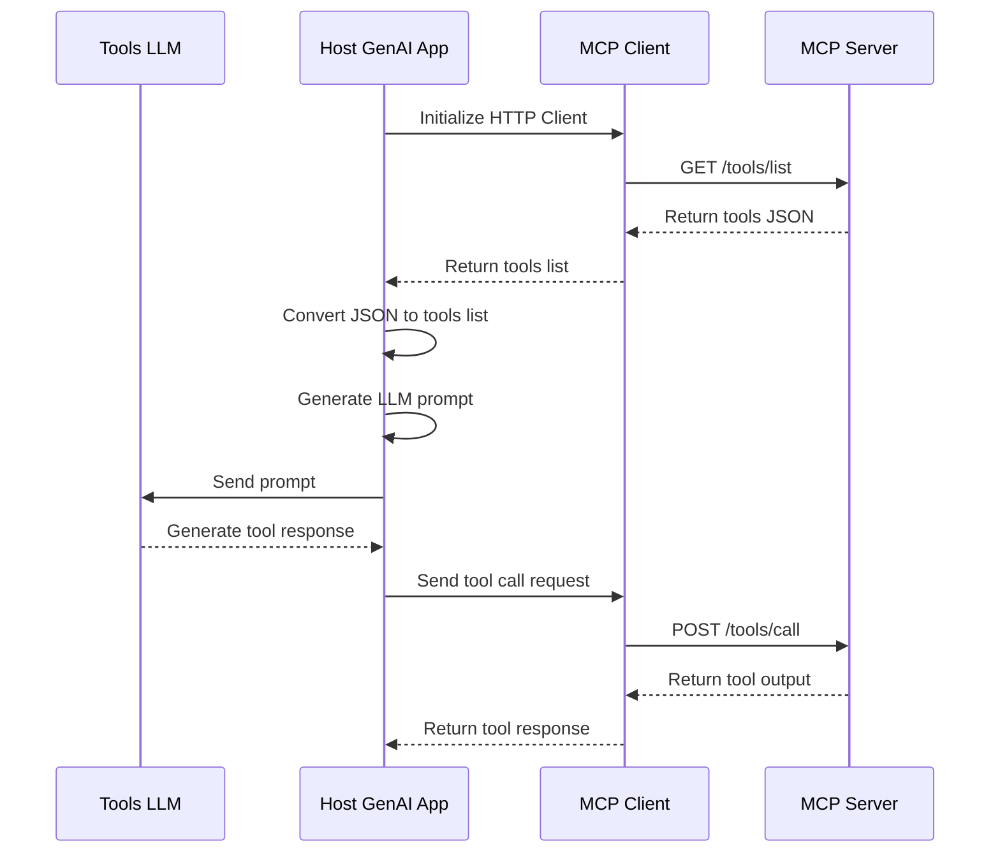

# AmphiPod 🦐

AmphiPod is a lightweight, HTTP-based **Model Context Protocol** (MCP) server implementation written in Go. It simplifies the integration of AI tools by providing an HTTP interface to the MCP specification and executing tools through WebAssembly plugins.

## 🌟 Key Features

- **HTTP-Based MCP Server**: Implements Anthropic's MCP specification using HTTP, making it accessible from any programming language
- **WebAssembly Tool Execution**: Leverages the Extism Framework for running tool plugins in WebAssembly
- **Language Agnostic**: Can be used with any programming language that supports HTTP requests
- **Lightweight & Fast**: Written in Go for optimal performance
- **Easy Integration**: Simple HTTP API for tool registration and execution

## 🎯 Why AmphiPod?

While Anthropic's MCP specification is excellent, it requires implementing MCP clients in each programming language. Currently, official SDKs are only available for Python, TypeScript, and Kotlin. AmphiPod solves this limitation by:

1. Using HTTP as the transport protocol, enabling any language with HTTP capabilities to interact with the MCP server
2. Simplifying the integration process for host AI applications
3. Providing a consistent interface across different programming languages
4. Executing tools through WebAssembly plugins for enhanced security and portability

## 🚀 Getting Started

> 🚧 This is a work in progress. Please check back later for installation instructions.
<!--
### Prerequisites

### Installation

### Basic Usage
-->

## 🔧 API Endpoints

- `GET /tools/list`: Get available tools
- `POST /tools/call`: Execute a tool

## 📦 Tool Development

AmphiPod uses **WebAssembly** plugins powered by the [**Extism** Framework](https://extism.org/). 

Look at the `./functions` directory for examples of WebAssembly plugins. 

## 🔄 Architecture Overview

## 🔄 Workflow Overview

The MCP Client will be a simple HTTP client run by the Host GenAI application. The MCP Client will make HTTP requests to the MCP Server to get the list of tools and to make tool calls. The MCP Server will respond with the list of tools and the output of the tool calls.

## 🤝 Contributing

Contributions are welcome! Please feel free to submit pull requests, report bugs, and suggest features.

## 📄 License

This project is licensed under the MIT License - see the [LICENSE](LICENSE) file for details.

## 🙏 Acknowledgments

- [Anthropic](https://www.anthropic.com) for the MCP specification
- The [Extism](https://extism.org/) team for their excellent WebAssembly framework

## 📚 Further Reading

- [Introducing the Model Context Protocol](https://www.anthropic.com/news/model-context-protocol)
- [Model Context Protocol Specification](https://modelcontextprotocol.io/introduction)
- [Extism Framework Documentation](https://extism.org/)
- [WebAssembly Documentation](https://webassembly.org/)
- [WASI Documentation](https://wasi.dev/)

