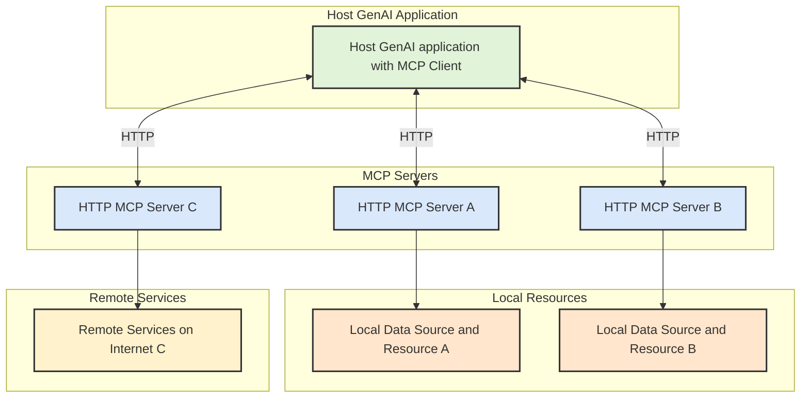
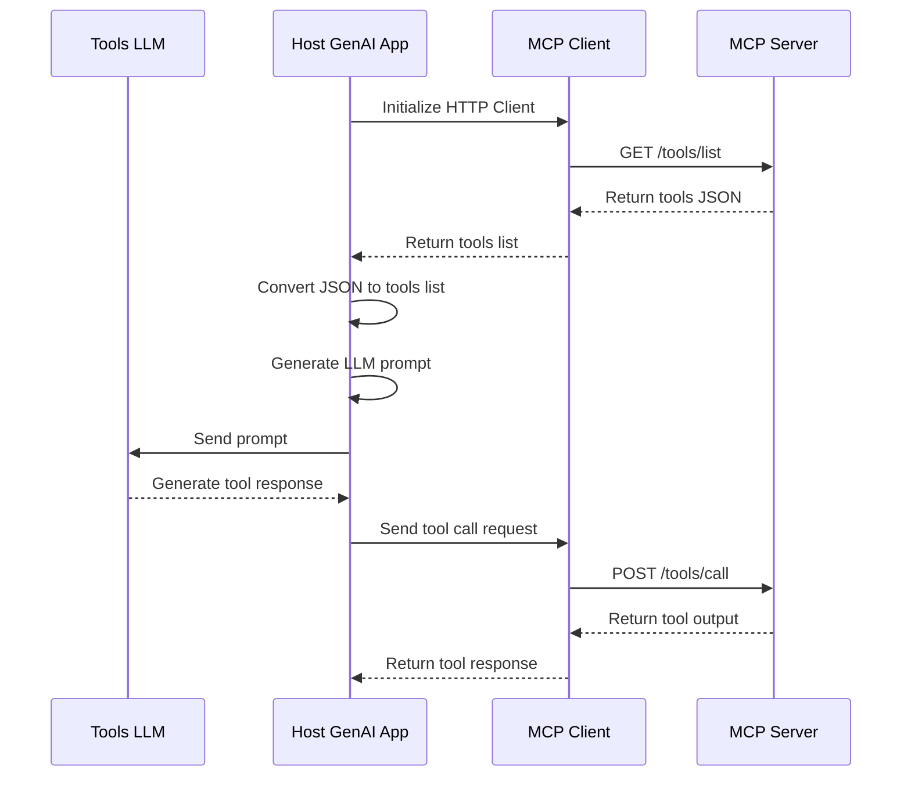

# AmphiPod

> Model Context Protocol HTTP server (Quick and dirty POC implementation of MCP on HTTP for experimentation)

Why: avoid implementation of a client for every language and platform

## Architecture Overview

## Workflow Overview

The MCP Client will be a simple HTTP client run by the Host GenAI application. The MCP Client will make HTTP requests to the MCP Server to get the list of tools and to make tool calls. The MCP Server will respond with the list of tools and the output of the tool calls.

